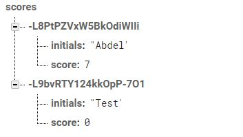

# Processing with Firebase Continued

## Quick Review

Great to be back! Soooo…. It has been a long break and I think it's reasonable just to take a minute to recap about the past entry. In the last entry, I utilized p5js with Firebase in order to create a leaderboard. Specifically, I utilized the real-time database feature on Firebase. I had to go through a quick process of setting up Firebase in the “functionSetup” section of my javascript bowling app. Furthermore, I had to establish a reference point of “scores” which I would send the JSON object containing both the initials and scores of the user. Finally, I ended my entry by finally pushing the JSON object using a “special token” or a unique ID. 
## What’s Next?

I was able to send user data to Firebase so, now I need to retrieve that data in order to create my leaderboard. It does sound simple but, in coding, even the simple things can turn into a labyrinth of more complicated things. 

## Getting Started Once More

In order to retrieve the data, I have to reference “scores” once more because I want to get the values within the same reference point I sent the data to. 

```javascript
var ref = database.ref('scores') // references to 'scores' section in database
```
 
An aside: this should be done in functionSetup because I want the database to appear once the game is loaded  

Then, in order to attain the values from the reference point, you have to use a certain Firebase method. 

``` javascript
ref.on('value', gotData, errData) // on the event value I want to get data but in case something goes wrong there is going to be a 'rescue' or an error statement
```
The code above has three components “value”,gotData, and errData. The first component, “value”, simply calls on the values of the reference point while gotData and errData are different functions that will be called depending on the success of attaining the data. In other words, if the data is retrievable then gotData will be called and if there is an error errData will be called. Function errData is really simple to write because you would just need to console log the error, which would be the parameter of the function, to see what the specific error was.  


``` javascript
function errData(err) {
  console.log("error")
  console.log(err)
 }
```

However, gotData is a little bit trickier because of the special token I have noted earlier in the Quick Review.



First, to retrieve the data, you would have to create a variable in which you would store in the data values.
```javascript
function gotData(data) {
    var scores= data.val()
}
```

In order to attain just the initials and scores as opposed to the tokens, initials, and scores, I had to create a for loop in order to iterate through each token and utilize just the initials and score. However, I don't know how many data values are in the “scores” reference so, I need a way to store all those tokens into a variable every time the database is updated. Luckily, there is a certain way to attain these tokens: 


```javascript
var tokens= Object.keys(scores)
```
From there you can create a simple for loop that will run based on the length of tokens or data pieces there are in “scores”. In the for loop, it is necessary to call “.initials” and “.score” on the initials and score variable because we are referring to that component of the data.  

``` javascript
for (i=0; tokens.length > i; i++){
   var t = tokens[i]
   var intials= scores[t].initials
   var score= scores[t].score
}
```
The hardest part (getting the data from Firebase back) is complete! Now, all there is left to do is to take those initials and scores and create an ordered list element to embed it into your HTML page. Pheww! That was a lot to take in. Gimme a second to take a deep breath.       

__Key Takeaways__: Reference points,iterations, and retrieving data

__Next Steps__: I completed half my goal which was to learn how to retrieve data from a realtime database which was awesome;however; I did not start the online web chatting tutorial on Firebase. I am going to make that tutorial my only goal for week three in order to get to explore the other major key components of Firebase which I believe will be really important in my overall independent study objective. In week four, I will be learning how to APIs with Javascript since Firebase is only compatible with javascript web apps. I am unsure how the next two weeks will go but, after week three I will definitely have better direction of where I am heading with this study. 


## "Standing on the Shoulders of Giants"

Once finishing this second Daniel Shiffman’s tutorial, I myself will share the GitHub repository with hope to help others in understanding Firebase. That being said, I couldn’t have learned so much once again without Shiffman’s very informative and helpful [video](https://www.youtube.com/watch?v=NcewaPfFR6Y) regarding this topic.  


