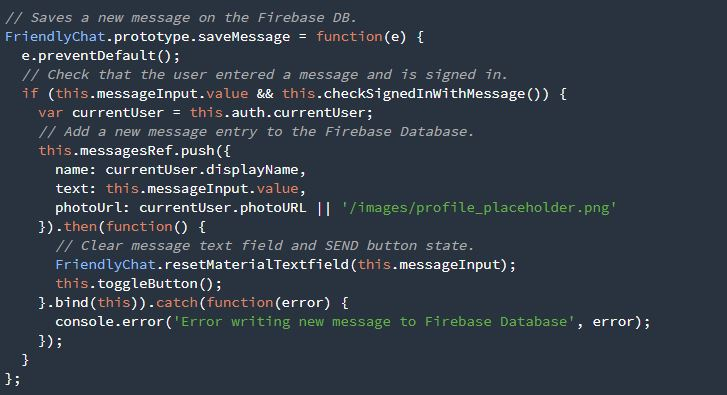

# The Not-So-Friendly-Webchat Tutorial

## Quick Intro and Disclaimer 
I have good and bad news. While we do typically argue about which one we should here first, I will try to state both in one sentence in order to make it quick, easy, and simple. The good news is I was able to complete the tutorial, the bad news is I had so many loopholes that I felt I was in a labyrinth most of the time while completing this tutorial. I do not know if I am ever going to feel this going forward in the independent study, but I am certain I am well prepared for my next step in the independent study. I regress. After learning that I am about to build a web chat that I can use with my friends and peers, I got really really excited and wanted to dive right in. But my excitement was met confusion and that confusion was met with more confusion. So without further ado, let me take you through an adventure of my very unique process of completing this [tutorial](https://codelabs.developers.google.com/codelabs/firebase-web/#0).
## Tutorial Tip
READ EVERYTHING. Read especially this for web chat tutorial:


If you're like me, go back and read the green box again. Really carefully. Ok, Let's move on now.

## Creating a Firebase project, Authentication, and Cloud sharing 
While I did go over this step in previous entries, this tutorial was different because it required you to set up the scripts inside the index.html file. Again remember to follow direction really closely. However, authentication was very new to me when doing this tutorial, but, luckily,  firebase made authentication really simple for developers. 
An aside: authentication is requiring the user to sign in or sign up in order to use the application
In order to require google authentication, all I needed to do was go to the Authentication > SIGN IN METHOD tab and enable google sign in authentication, and, of course, I needed to make sure I Saved that request. Cloud sharing was very simple to enable. All you need to do is press the “Get Started” button under Cloud Sharing. 

## This sounds too good to be true. Welllll…
It is hard to panic when you are confronted by a lot of terms you do not know. You have that sudden urge to just google every term and understand everything before you get confused at all. DON’T. You are going to confuse yourself more. Read page 4 thoroughly and run through the steps and if there are any errors then google them. First, install npm in order for your app to function utilizing the following command: 
```commandline
npm -g install firebase-tools
```
Next, simply check the firebase version in order to  ensure that the Firebase Command Line Interface (CLI) is running properly:
```commandline
firebase --version
```
The next step was very tricky since I was using an online IDE, cloud9, as opposed to a local one like atom. I tried following the command they told me to input in my command line: 
```commandline
firebase login
```
However, nothing happened after I tried to log in using my Gmail over and over again. This step was extremely vital because this was how I was going to Authorize the Firebase CLI. I googled the error “no localhost found” for over an hour but got no results at all. However, when I did have the chance to step back and read over the tutorial multiple of times, I realized that things were going to have to be a bit different for me because I was using cloud 9. Once I googled “no localhost firebase and cloud 9”, the first result was a stack overflow question posed about this with the following solution: 
```commandline
firebase login --no-localhost
```
I received a unique code one I logged in that I had to copy and paste in my command line in order to complete the authentication.
I was able to follow the last step in on the fourth page which required me to add the Firebase project and give it a named alias(“definitions which are written to a .firebaserc file inside your project directory”-Pedro Magalhães):
```commandline
firebase use --add
```
## Shotgun + Firebase = Shotbase ?
Page 5 of the tutorial required us to run the following command: 
```commandline
firebase serve
```
However, there was another error because once again I was coding in an online IDE. Before I googled it, I was fortunate to have two companions who were also doing the same independent study which notified me that I would have to run a different command in order to get firebase to work:  
```commandline
firebase serve -o $IP -p $PORT
```
And…. Drum Roll Please…. It worked!
I was so happy but…. I was not done yet. Much more was to come in the sea of web chats.

## User Sign-in
Page 6 was basically a lot of code snippets with explanations and instructions on where to place those code snippets in your code(pssst… script.js) in order to allow a user to sign in to the web chat app and communicate with other people. I am going to go through each snippet and provide my own explanation of how it works in order to better understand it, help you understand it, and hopefully use this information for my final product. 

Snippet One: initFirebase


This snippet initiates the real-time database, authentication, and cloud storage. I tried looking up what “this.” implies, but I could not find anything very useful, so I ascertain that it calls “.this” as a way of referencing the app that will use this script. The last line of the snippet simply keeps track of user authentication status (signed-in or signed-out).

Snippet Two: signIn


This code demonstrates how to utilize a certain provider for authentication and line two demonstrates how to allow the user to sign in with a pop-up Gmail form. I will try to research how to sign in with different providers in the incoming entries.  

Snippet Three: signOut


Calls on the authentication method in order to change status to “signed out”.

Snippet Four: onAuthStateChanged


When the user is signed on, show user’s profile picture and name by attaining that info from “the Firebase user object.”

Snippet Five: checkSignedInWithMessage


If a user is signed in, return true; otherwise, if they try utilizing the app, let the user know that he or she is not signed in by alerting them to a message.

## Messenger 2.0
Of course, I am joking. However, after following the next two snippets, your app is basically functional. Sooooo Let's Dive Right In!

Snippet Six: loadMessages


This snippet first references the message's endpoint in order to both save and retrieve the messages(as I have discussed earlier in the last two entries). In addition, this snippet demonstrates how to attain the data value in regards to the name of who is sending the data and what they are sending: text or image(local photo or URL). The last two lines limit the number of texts that the user can view to 12 even as the messages change.

Snippet Seven: saveMessage



This is where the heart of the program lies. This method tells tell firebase to store the user display name, message, and image. Furthermore, it commands to clear the text box once the user has pressed “send.”

## Conclusion and Takeaways
I have added the feature in which a user can send an image through the webchat, but I am still currently trying to get the notifications to work. I thought that ending this entry once I having a basic running web chat app was most appropriate. I have undoubtedly learned very much during this week. One simple but very important takes away that I will always keep in mind for the rest of experiences would be to simply become open-minded and cautious when trying to learn a new thing. I set my database rules to false when I first initialized my firebase project, and that completely stopped me from completing my tutorial. It took me hours to fix a mistake that I unconsciously did in a second or two because I was trying to bring in unnecessary prior knowledge from my past two entries into this tutorial.  Finally, I hope that next week I will be able to utilize APIs with javascript in order to further utilize my app with Firebase add-ons.   