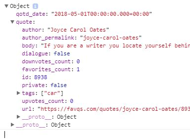

# Javascript and APIs 

## Our Usual Intro…
The mind is a very delicate tool. Therefore, it must be treated with comfort and simplicity. I know that I am being a bit too much philosophical right now, but I have a story to tell you about my very interesting deep claims. In order to construct an application that I could utilize with Firebase, I needed to learn Javascript. I felt really intimidated. As a result, I ended up going in endless cycles of uncertainty instead of actually focusing on the learning process I needed to attain in order to master Javascript with APIs. Essentially, I learned that when you attempt to learn anything unknown or new, you need to give it all the positive attitude you got because “an optimistic person always sees opportunity in every difficulty and a pessimistic person always sees a difficulty in every opportunity”(Winston Churchill). Nevertheless, in this entry, I will explain the two major components I needed to focus on in order to get APIs to work with a simple Javascript library(p5js).   

## Buffering…….loadJSON!
In ruby, I would need a whole snippet like the one below in order to attain data from a URL: 

``` ruby
require 'net/http'
require 'json'

url = 'https://api.spotify.com/v1/search?type=artist&q=tycho'
uri = URI(url)
response = Net::HTTP.get(uri)
JSON.parse(response)
```

Luckily, in the p5js library, all I need is the following one line code in order to attain data from a URL. 


``` javascript
loadJSON("URL HERE")
```

However, if you try to run the following code, it will not work because you would need a method dedicated to prompt your application to do something with this data. I created a function gotData that simply logged the data onto the console:

loadJSON updated: 
``` javascript
loadJSON("URL HERE",gotData)
```

gotData function:
``` javascript
function gotData(data) {
  console.log(data)
}
```

## Data-strophe!
Perhaps you do want to use the following data: "qotd_date":"2018-04-30T00:00:00.000+00:00." However, you would love to use other pieces of your data. No problemo. Dots to the rescue!
Look at the Picture below:



In order to access just the “quote body” part of the data, you would need to utilize the following syntax: 
``` javascript
  quote = data.quote.body
  author = data.quote.author
```

Essentially, you would need to navigate from key to value pairs by looking at parent variables.
## String is NOT a String
The title is definitely not a criticism of strings as a material, but something that programmers need to pay attention to when actually utilizing data. First, you need to ask something really vital what type of data am I using? After attaining both my data values I wanted to utilize them; however, they were not valid because they were not strings. As I placed my data values on console.log, I realized that there were no quotations around them; therefore, I needed to convert the data into a strong by utilizing the “toString” function.
## Takeaways and Next Steps
My key takeaway from this week’s work would be to learn to take the time to evaluate your resources. I learned how to effectively google unknown terms or concepts; however, too much googling without caution can also make you confused. Once I entered this topic, I was really worried about how to correctly approach it to the point that I jumped from one site to another in a matter of seconds because I wanted answers. This is why I was going through endless cycles of confusion. In order to correctly utilize Google as a search engine, you need to know how to effectively look for certain terms and concepts, but also learn to take time to evaluate each resource accordingly. Finally, my next step would be to use this knowledge in order to learn how to take user input and give back the user certain data based on that input.
